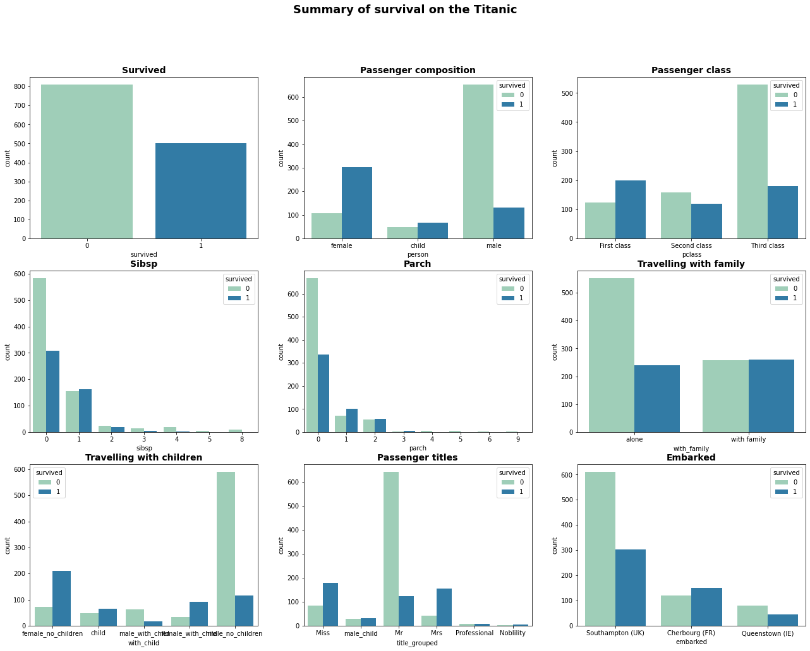
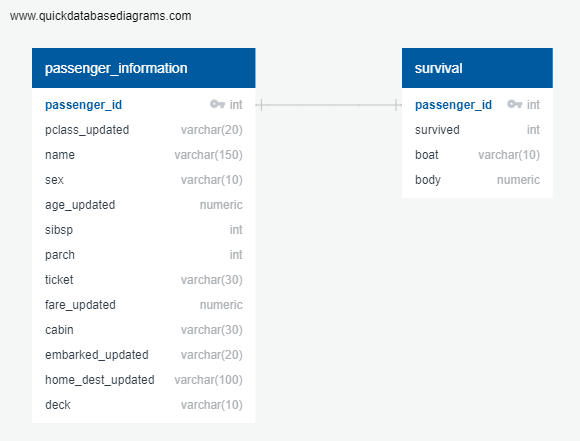
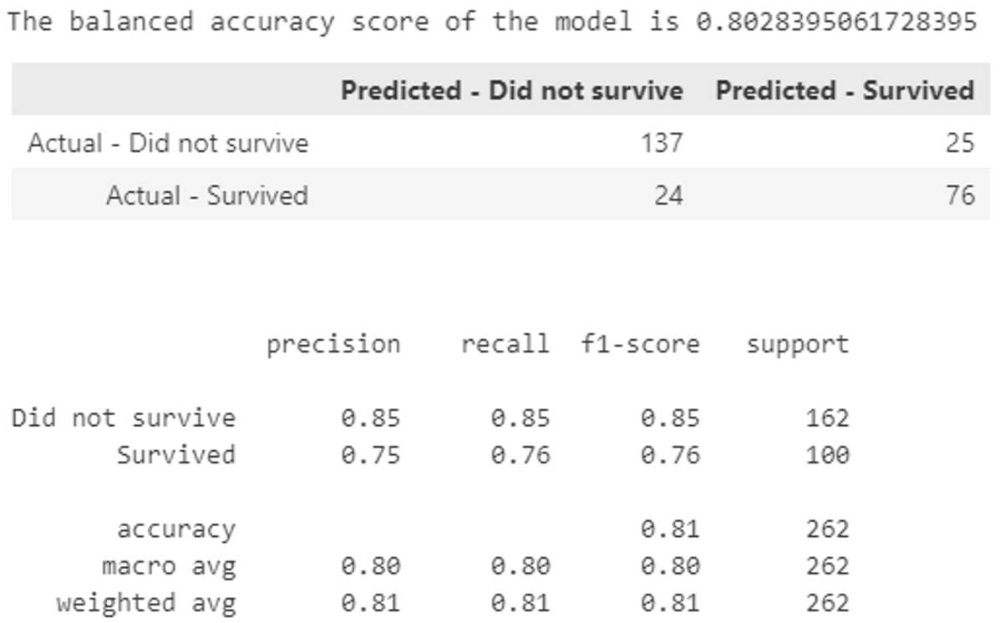
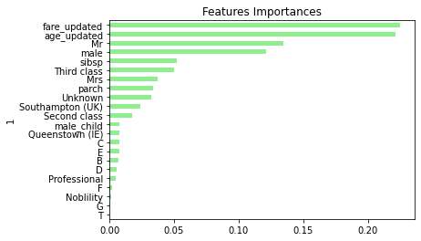
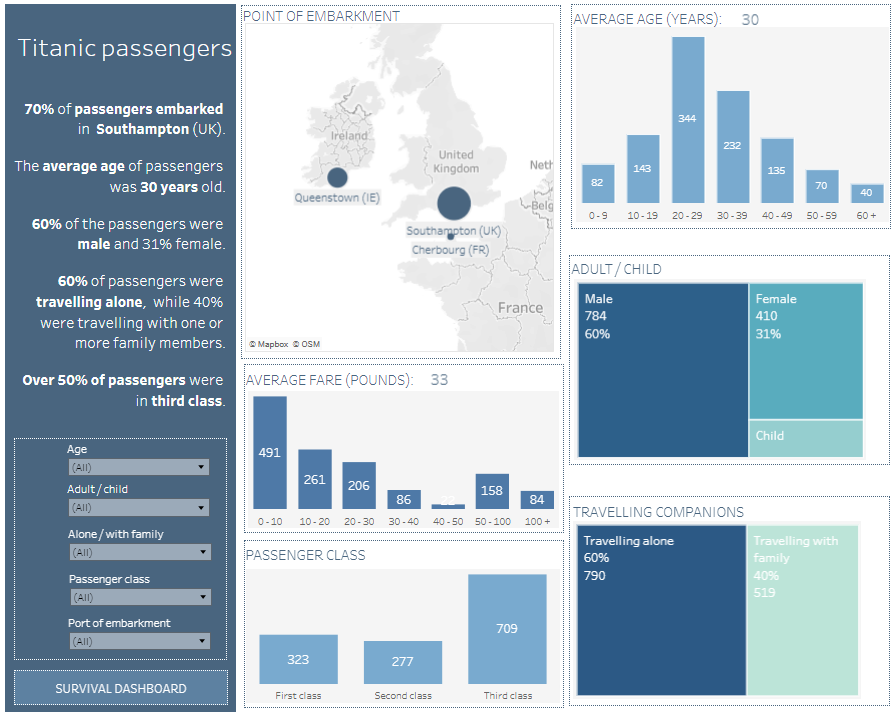
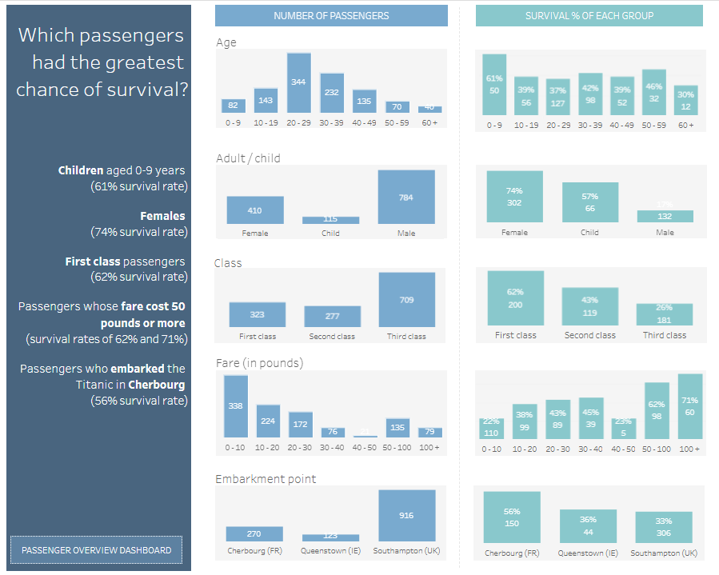

# Predicting who survived the Titanic

### **Purpose**
Use machine learning to create a classification model that predicts which passengers survived the Titanic.

### **Data source**
The complete titanic dataset available on [kaggle](https://www.kaggle.com/datasets/vinicius150987/titanic3) was used.  It includes 1309 passengers.

### **Aspects covered**
There were five key stages for this project:
1. Cleaning and exploring the data in python
2. Creating a database in SQL and loading the data into it
3. Logistic regression
4. Random forest
5. Data visualisation

Additional detail on each stage is provided below.

---
### **Stage 1 - Cleaning and exploring the data in Python**
- Data cleaning was focused on handling missing values, as this impacted several fields.
   - One important field missing data was age. Passengers who did not have an age were assigned one based on the average age for a person of their sex and passenger class.
 - Data was explored and charts created to gain an understanding of the data and which passengers had higher survival rates.  Side by side bar charts were used to see the differences between groups.  An example is shown below.

 

### **Stage 2 - Creating a database in SQL and loading the data into it**
- The cleaned data was split into two tables, one with passenger information and the other with survival information.  A SQL database was then created and the data saved into it.

### **Stage 3 - Logistic Regression (using sklearn)**
- Logistic regression was selected as it has good accuracy for simple datasets, is less inclined to over-fitting, and is easier to interpret and efficient to train.
- Given the known outcome of the Titanic feature engineering was focused on, looking at fields that would indicate some level of status / wealth.
- An iterative approach was used to tune the model. With a balanced accuracy score of 80% achieved as a result of the following changes:
   - Using random oversampling due to the slight imbalance in the dataset (62% of passengers not surviving and 38% surviving)
   - Including the title of passengers (extracted from their name)
   - Changing the train test split to 80/20.

### **Stage 4 - Random Forest**
- Random forest was selected as it is robust to outliers and noise in the data, additionally it ranks independent variables in order of importance helping to aid interpretation of the model.
- The model was tuned by increasing the number of trees in the forest from 500, to 1,000, to 2,000.
- Changing the number of trees had minimal impact on the accuracy with all sitting in the realm of 78% to 79%.
- Fare and age were found to be the most important features in the model, both at 22% importance each.

### **Stage 4 - Data visualiation**
 - The data visualisation looked to provide an overview of Titanic passengers and the different survival rates.  
 - A webpage was created with tableau dashboards embedded . The webpage was deployed via [github-pages](https://kimco2.github.io/Titanic_survival_predictions/). Screen shots are provided below.

 

---

### **Contact**
Email: kymcoleman@gmail.com

---